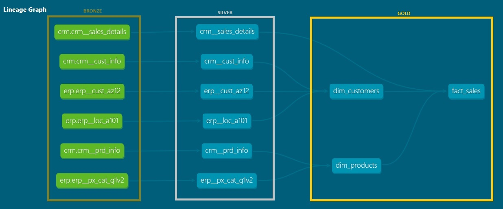
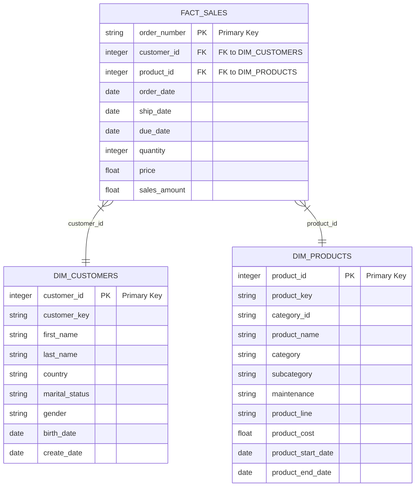

## Project Data Engineering and Analytics

### Data Warehouse

#### Integrating Sales Systems to provide Data ready for querying 

### Building the Data Warehouse

- The objective is to develop a modern data warehouse to consolidate sales data and enable analytical reporting

- The project uses 2 sources of data, the ERP and CRM systems. The master system is CRM. The data is provided as CSV files.

- The project will use the medallion architecture, using the 3 layers: Bronze, Silver and Gold.

- **Bronze Layer**: The data will be loaded as-is

- **Silver Layer**: Cleaning, standardization and normalization to prepare data for analysis.

- **Gold Layer**: Preparation of data marts and business-focused tables.

### 01. Bronze Layer
- Creating the database and schemas.
    - [scripts/00_db_schemas.sql]
- Creating Bronze Layer
- Analysing Source Systems
    - Business Context & Ownership
    - Architecture & Technology Stack: Postgres, Medallion 
    - Extract & Load: Full loads        
- Coding to data ingestion: DDL and load
    - [Scripts/01_1_ddl_bronze.sql]  
    - [scripts/01_2_proc_load_bronze.sql]
- Validating: Data completeness & schema checks
    - [Scripts/01_3_quality_checks_bronze.sql]
- Documentation: Data versioning in git

## Integrating DBT:
- Created a new schema [src_schema_bronze.yml] to use as a "source" and documentation in dbt

### 02. Silver Layer
The goal of this layer:

- Understand How the tables connect to each other. To do this, a data integration model was created using 6 source tables, identifying keys that link each table.

    

### Scripts to construct, clean, standarize, normalize eache table:
    - |scripts\02_silver
        - |4_1_checks_silver_crm_cust_info.sql
        - |04_2_checks_silver_crm_prd_info.sql
        - |04_3_checks_silver_crm_sales_details.sql
        - |04_4_checks_silver_erp_az212.sql
        - |04_5_checks_silver_erp_loc_a101.sql
        - |04_06_checks_silver_erp_px_cat_g1v2.sql

### DBT Silver models by source
    - |dbt_datawarehouse\models\silver\crm
    - |dbt_datawarehouse\models\silver\erp

### 03. Gold Layer

- Dimension Table
    - dim_products
    - dim_customers

- Fact Table
    - crm_sales_details

- Star Schema
- Aggregated objects
- Flat tables

### Final Dbt Lineage Graph

    

## SALES Schema - Star Schema ERD  
### Gold Layer

