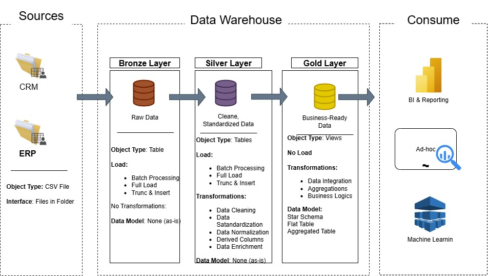
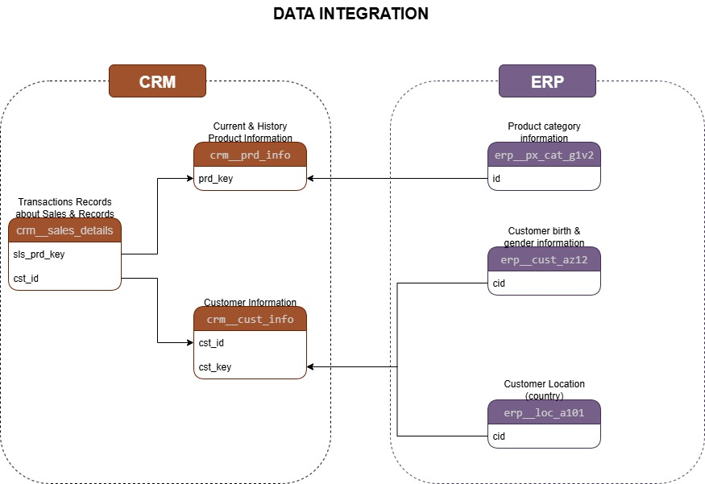

## Project Data Engineering and Analytics

### Data Warehouse

#### Integrating Sales Systems to provide Data ready to query 

### Building the Data WareHouse

- The objective is to develop a modern data warehouse to consolidate sales data and enable analytical reporting

- The project uses 2 sources of data, the ERP and CRM system. The master system is the CRM system. The data is provided as CSV files.

- The project will use the medallion architecture, using the 3 layers Bronze, Silver and Gold.

- **Bronze Layer**: The data will be loaded as-is

- **Silver Layer**: Cleaning, standardization, normalization to prepare data for analysis.

- **Gold Layer**: Preparation of data marts and business-focused tables.

### 01. Bronze Layer
- Creating the database and schemas 
    >> [scripts/00_db_schemas.sql]
- Creating Bronze Layer
- Analysing Source System
    - Business Context & Ownership
    - Architecture & Technology Stack: Postgres, Medallion 
    - Extract & Load: Full loads        
- Coding to data ingestion: ddl and load
    >> [Scripts/01_bronze_create_tables.sql]  
    >> [scripts/02_bronze_load.sql]
- Validating: Data completeness & schema checks
    >> [Scripts/03_quality_checks_bronze.sql]
- Docs: Data documenting versioning in git

## Integrating DBT:
- Created a new schema [src_schema_bronze.yml] to use like "source" and documentation to dbt

### 02. Silver Layer
The goal of this layer:

- Understand How the tables connect to each other, to do this, using the 6 tables from sources was made the data integration model, understanding the keys that can connect each table

    

